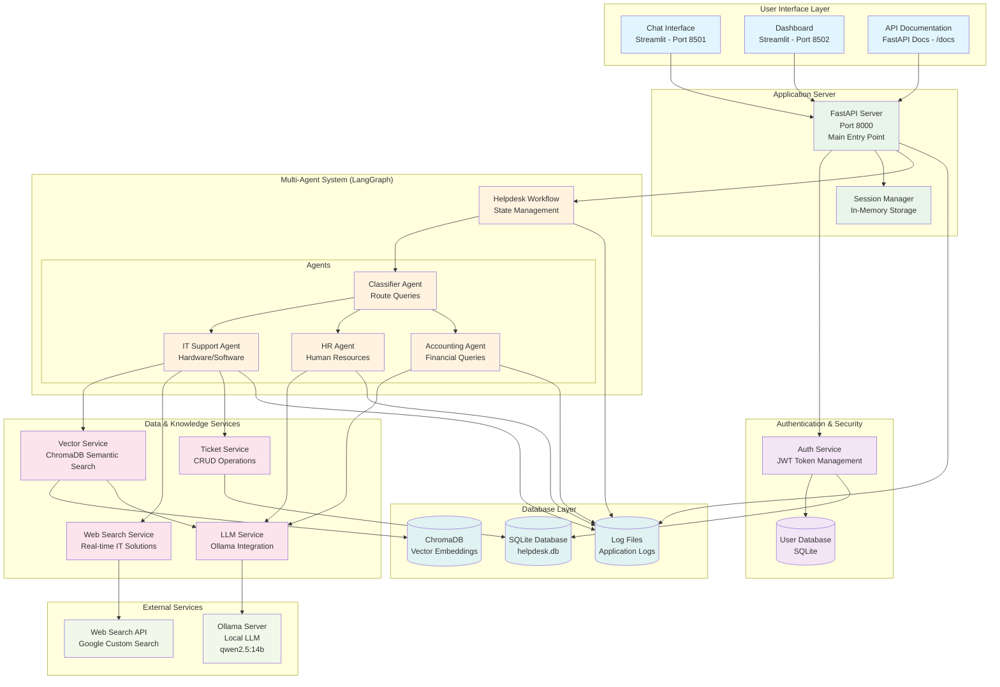

# IT Helpdesk System - Architecture Diagram



## Architecture Components Overview

### 1. User Interface Layer
- **Chat Interface** (Streamlit): Interactive chat for users to submit queries
- **Dashboard** (Streamlit): Analytics and ticket management for support engineers
- **API Documentation**: Auto-generated FastAPI documentation

### 2. Authentication & Security
- **JWT-based Authentication**: Secure token-based user authentication
- **Role-based Access Control**: User and Support Engineer roles
- **Session Management**: Secure session handling

### 3. Application Server
- **FastAPI Server**: RESTful API with automatic documentation
- **Session Manager**: Maintains conversation context across interactions
- **CORS Middleware**: Cross-origin resource sharing support

### 4. Multi-Agent System (LangGraph)
- **Workflow Engine**: Orchestrates agent interactions using state graphs
- **Classifier Agent**: Routes queries to appropriate specialized agents
- **Specialized Agents**: IT Support, HR, and Accounting agents with domain expertise

### 5. Data & Knowledge Services
- **Vector Service**: Semantic search using ChromaDB for knowledge retrieval
- **Ticket Service**: Complete ticket lifecycle management
- **Web Search Service**: Real-time web search for IT solutions
- **LLM Service**: Local language model integration via Ollama

### 6. External Services
- **Ollama Server**: Local LLM hosting (qwen2.5:14b model)
- **Web Search API**: Google Custom Search for real-time information

### 7. Database Layer
- **SQLite Database**: User accounts, tickets, and chat logs
- **ChromaDB**: Vector embeddings for semantic search
- **Log Files**: Comprehensive application logging

## Data Flow

### 1. User Interaction Flow
```
User Input → UI → API → Authentication → Workflow → Agent → Response
```

### 2. Agent Decision Flow
```
Query → Classifier Agent → Category Classification → Specialized Agent → Action
```

### 3. Knowledge Retrieval Flow
```
Query → Vector Service → ChromaDB Search → LLM Processing → Response
```

### 4. Ticket Creation Flow
```
Unresolved Issue → IT Agent → Ticket Service → Database → Ticket ID
```

## Key Design Patterns

### 1. Multi-Agent Architecture
- **Separation of Concerns**: Each agent handles specific domain expertise
- **Scalability**: Easy to add new agents for different categories
- **Maintainability**: Isolated agent logic for easier updates

### 2. State Management
- **LangGraph State**: Maintains conversation context across multiple turns
- **Session Persistence**: In-memory storage for active conversations
- **Database Persistence**: Long-term storage of tickets and user data

### 3. Service-Oriented Architecture
- **Modular Services**: Separate services for authentication, tickets, vectors, etc.
- **Loose Coupling**: Services communicate through well-defined interfaces
- **Testability**: Each service can be tested independently

### 4. Knowledge Integration
- **Hybrid Approach**: Combines local knowledge base with real-time web search
- **Semantic Search**: Vector embeddings for intelligent knowledge retrieval
- **Context Awareness**: Maintains conversation context for better responses

## Security Architecture

### Authentication Flow
```
Login Request → Credential Validation → JWT Token Generation → Token Verification
```

### Authorization Layers
- **Public Endpoints**: Health checks, login
- **Authenticated Endpoints**: Chat, user tickets, analytics
- **Support Engineer Only**: All tickets, ticket updates, system management

## Scalability Considerations

### Horizontal Scaling
- **Stateless API**: FastAPI server can be replicated
- **Session Externalization**: Can move to Redis for distributed sessions
- **Database Scaling**: Can migrate from SQLite to PostgreSQL

### Performance Optimization
- **Vector Caching**: ChromaDB provides efficient similarity search
- **Async Operations**: FastAPI async support for concurrent requests
- **Connection Pooling**: Database connection management

## Technology Stack Integration

### Core Technologies
- **FastAPI**: High-performance web framework
- **LangGraph**: Agent workflow orchestration
- **ChromaDB**: Vector database for semantic search
- **Ollama**: Local LLM serving
- **Streamlit**: Rapid UI development
- **SQLite**: Lightweight database for development

### AI/ML Components
- **Language Models**: Ollama-hosted models (qwen2.5:14b)
- **Vector Embeddings**: Semantic search capabilities
- **Classification**: Intent classification for agent routing
- **Context Management**: Multi-turn conversation handling